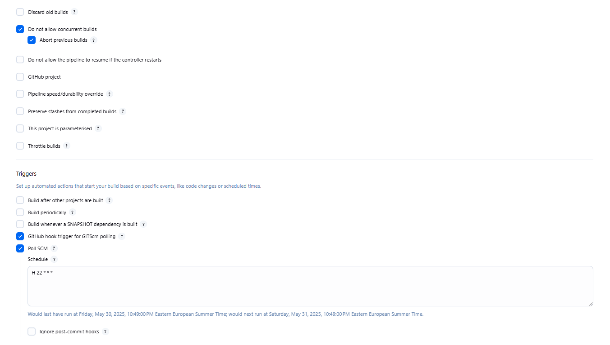
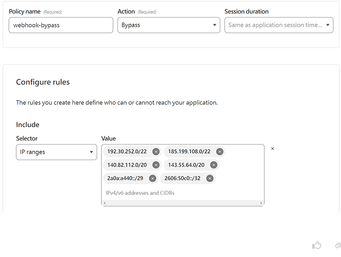
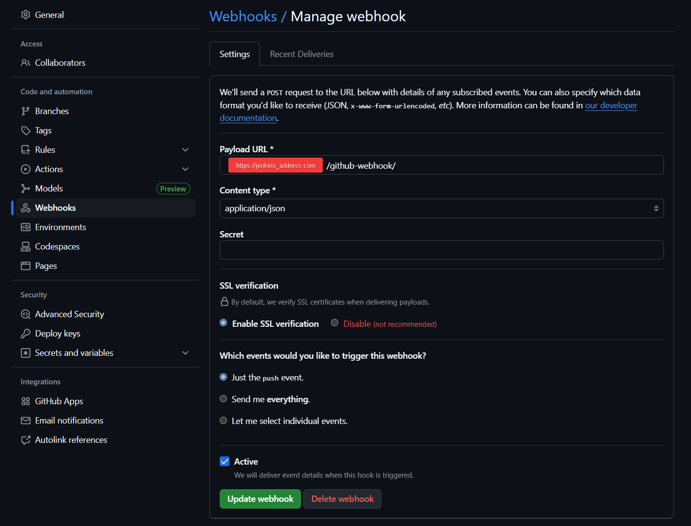
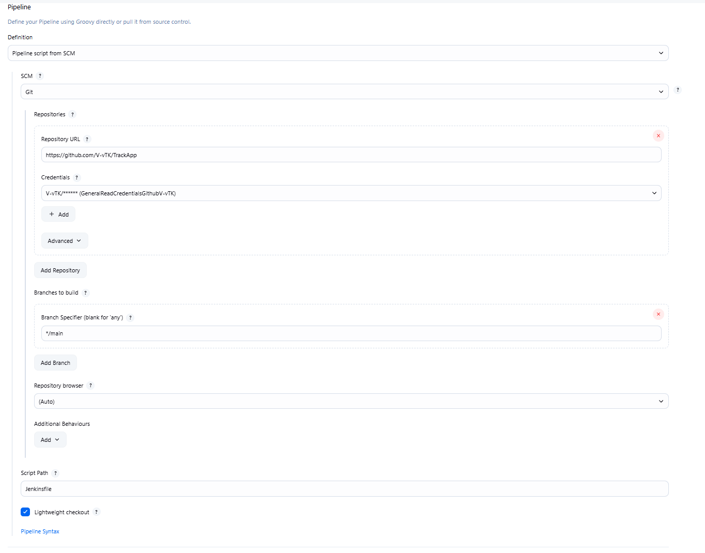
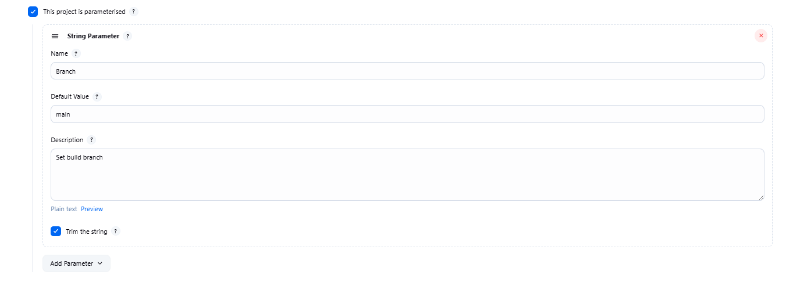
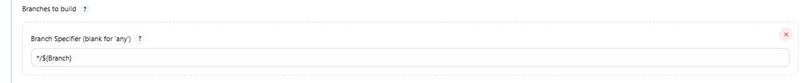

# DinD-Jenkins

Jenkins with Docker-in-Docker (DinD) support – Run Jenkins in a container with full Docker capabilities, including building and running Docker containers inside Jenkins jobs.

```
git clone https://github.com/V-vTK/DinD-Jenkins
cd DinD-Jenkins
```

```
docker compose up -d
```

The application opens up at `http://localhost:9900`

Create admin user, select plugins. Cascy (Code as configuration) setup coming soon.

Jenkins data is saved at `./data/jenkins_home`.

**Exmaple job configuration for CI/CD.**



Inside Triggers either use Poll SCM, which are timed (not reccomended) or use Github hooks.

If Jenkins is running behind CloudFlare middleware Github hook IP addresses have to be bypassed for commit hooks. IP addresses can be found [here](https://api.github.com/meta). The resulting rule should look something like this:



[Source](https://community.cloudflare.com/t/github-webhook-acces-with-cloudflare-one-time-pin-protection/484216)

Next, configure webhooks for your repository:



The rebuild should now trigger after each commit to main branch. Jenkins reports build reason as "Started by Github push by ..."

It's reccomended that the pipeline script is configured inside the repository:



A variable branch can be configured with:






Example Docker CI/CD pipeline script can be found at: [https://github.com/V-vTK/NextPB-Auth-Starter](https://github.com/V-vTK/NextPB-Auth-Starterhttps:/).
